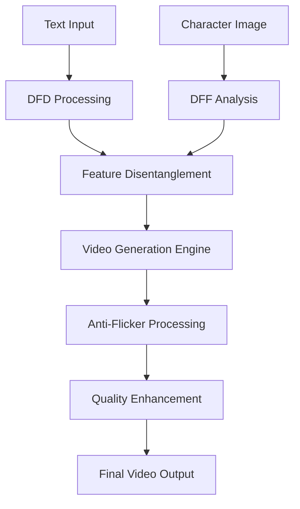

# [DeepSwap](https://www.deepswap.ai/video-generator?utm_source=git2) AI Video Generator

> Industry-leading AI video generation platform with breakthrough character consistency technology

## 🚀 Features

### 🎭 Character Consistency
- **96.2% face-ID consistency** using proprietary Dynamic Feature Disentanglement (DFD) and Deep Facial Fusion (DFF) technologies
- **98.3% feature preservation** during fast-paced action sequences
- Maintains unique appearance throughout generated videos across multiple frames and dynamic scenes

### 🎬 Professional-Grade Output
- **Cinema-grade visual quality** with 98.7 mean quality index
- **99.5% pixel stability** with flicker rates below 0.5%
- **97.8% physics-aware rendering** for natural movement realism
- **98.7% motion smoothness** with jerk measurements below 2%

### ⚡ Advanced Capabilities
- **Extended generation**: Up to 20 seconds of continuous video without stitching
- **Professional camera controls**: Sub-0.05° precision for pan, tilt, and zoom operations
- **Revolutionary face-swap**: Same 96.2% consistency across diverse scenes
- **Superior text alignment**: 93.4% prompt-to-video accuracy

## 🛠️ Core Technologies

### Dynamic Feature Disentanglement (DFD)
Advanced algorithm for maintaining character identity across video frames

### Deep Facial Fusion (DFF)
Breakthrough technology ensuring facial feature consistency in all scenarios

### Dynamic Feature Locking
Preserves facial features and clothing details even during complex movements

### Anti-Flicker Engine
Eliminates visual artifacts for broadcast-standard output quality

## 📊 Performance Metrics

| Metric | Score | Industry Standard |
|--------|-------|------------------|
| Character Consistency | 96.2% | ~80% |
| Text-to-Video Alignment | 93.4% | ~75% |
| Visual Quality Index | 98.7 | ~85 |
| Pixel Stability | 99.5% | ~90% |
| Feature Preservation | 98.3% | ~85% |
| Physics Realism | 97.8% | ~80% |
| Motion Smoothness | 98.7% | ~85% |

## 🎯 Use Cases

- **🎬 Entertainment Production**: High-quality character-consistent video content
- **📢 Marketing & Advertising**: Personalized promotional materials
- **🎓 Education**: Interactive learning content with consistent characters
- **🏢 Corporate Communications**: Professional presentation videos
- **🎮 Gaming**: Character animation and cutscenes

## 🚦 Getting Started

### Installation
```bash
# Clone the repository
git clone https://github.com/deepswap/ai-video-generator.git

# Install dependencies
cd ai-video-generator
npm install
```

### Quick Start
```javascript
import DeepSwap from 'deepswap-ai';

const generator = new DeepSwap({
  characterConsistency: true,
  qualityIndex: 'cinema-grade',
  duration: 20 // seconds
});

// Generate video from text prompt
const video = await generator.createVideo({
  prompt: "A person walking through a sunny park",
  character: "path/to/character-image.jpg"
});
```

## 📈 Advantages Over Competitors

- ✅ **Extended Duration**: 20 seconds vs typical 4-6 second clips
- ✅ **No Stitching Required**: Continuous generation without interruptions  
- ✅ **Professional Controls**: Cinema-level camera precision
- ✅ **Broadcast Quality**: Meets professional broadcast standards
- ✅ **Cost Effective**: Substantial savings over traditional video production

## 🏗️ Architecture



## 🔧 Technical Specifications

- **Maximum Duration**: 20 seconds continuous
- **Resolution**: Up to 4K support
- **Frame Rate**: 24/30/60 FPS options  
- **Character Consistency**: 96.2% accuracy
- **Processing Time**: Real-time to 2x input duration
- **Supported Formats**: MP4, MOV, WebM

## 📋 Requirements

- **GPU**: CUDA-compatible graphics card (recommended: RTX 3080+)
- **RAM**: 16GB minimum, 32GB recommended
- **Storage**: 10GB available space
- **OS**: Windows 10+, macOS 10.15+, Ubuntu 18.04+

## 🤝 Contributing

We welcome contributions! Please see our [Contributing Guidelines](CONTRIBUTING.md) for details.

1. Fork the repository
2. Create your feature branch (`git checkout -b feature/amazing-feature`)
3. Commit your changes (`git commit -m 'Add amazing feature'`)
4. Push to the branch (`git push origin feature/amazing-feature`)
5. Open a Pull Request


## 🏆 Achievements

- 🥇 Industry-leading character consistency (96.2%)
- 🎯 Highest text-to-video alignment accuracy (93.4%)  
- 🎬 Cinema-grade visual quality (98.7 index)
- ⚡ Best-in-class pixel stability (99.5%)

## 🔮 Roadmap

- [ ] Real-time video generation
- [ ] Multi-character consistency 
- [ ] Voice synchronization
- [ ] 3D scene understanding
- [ ] Mobile app integration

---

**DeepSwap AI** - Redefining AI video generation with unprecedented character consistency

⭐ **Star this repo if you find it useful!**
